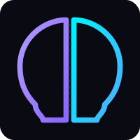
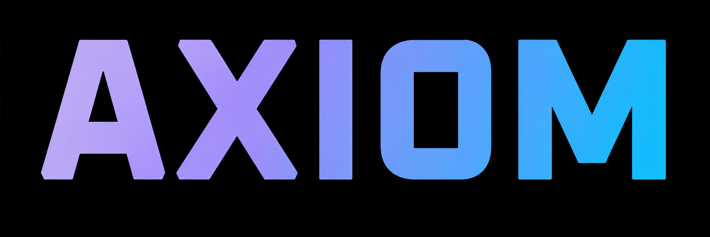
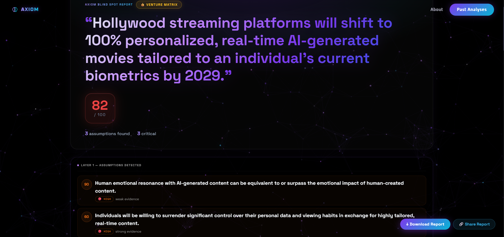

<div align="center">


<br/>


### The Cognitive Stress-Test & Blind Spot Engine

**AXIOM doesn't just analyze ideas — it tries to break them, so the market doesn't have to.**

A multi-agent epistemic interrogation system that uncovers the hidden assumptions, biases, and structural blind spots inside any startup thesis or philosophical claim — before a VC, a customer, or reality finds them for you.

<br/>

[](https://axiom-pied-zeta.vercel.app)
[](https://github.com/AmitK241/Axiom/stargazers)
[](LICENSE)

<br/>

[](#)
[](#)
[](#)
[](#)
[](#)

</div>

---

## 📋 Table of Contents

- [The Problem](#-the-problem)
- [The Solution: A Crash Test Simulator for Ideas](#-the-solution-a-crash-test-simulator-for-ideas)
- [How It Works](#-how-it-works)
- [The Dual Matrix Engine](#-the-dual-matrix-engine)
- [Live Demo](#-live-demo)
- [Tech Stack](#-tech-stack)
- [Quick Start](#-quick-start)
- [Roadmap](#-roadmap)
- [License](#-license)

---

## 🎯 The Problem

Every founder, researcher, and decision-maker operates on assumptions they can't see — because if they could see them, they wouldn't hold them. These invisible beliefs are exactly what surface too late: after the funding round, after the product launch, after the paper is published.

The market eventually finds these blind spots. **AXIOM finds them first.**

---

## 🚗 The Solution: A Crash Test Simulator for Ideas

Every founder thinks their idea is a supercar — sleek, fast, ready for the road.

**AXIOM is the wall it drives into first.**

Feed AXIOM a belief, a startup thesis, or a philosophical claim. Four specialized AI agents debate it from every angle — attacking its weakest joints, stress-testing its assumptions, and mapping exactly where it would crumple under real-world pressure.

> **Output: a Resiliency Score (0–100)** — how much of your idea survives the crash, and precisely which assumptions caused the damage.

---

## 🔬 How It Works

AXIOM runs every input through a 4-layer epistemic pipeline:

| Layer | What Happens |
|---|---|
| **01 · Extract** | AXIOM decomposes your input into its hidden, unstated assumptions |
| **02 · Debate** | Four AI agents (matrix-specific — see below) attack, defend, and cross-examine each assumption in real time |
| **03 · Alternative Worlds** | AXIOM generates the most probable scenarios in which your core assumptions turn out to be wrong |
| **04 · Score** | A weighted Resiliency Score (0–100) is calculated across hiddenness, evidence weakness, and paradigm impact |

---

## ⚙️ The Dual Matrix Engine

AXIOM routes every analysis through one of **two specialized 4-agent matrices**, each tuned for a different kind of claim.

### 🏦 Matrix 1 — Startup & Venture Capital

| Agent | Role |
|---|---|
| 💰 **The Investor** | Evaluates product-market fit, scalable unit economics, and venture-grade returns |
| ⚔️ **The Critic** | Attacks weak operational assumptions, scalability gaps, and distribution blockers |
| 🛒 **The Customer** | Tests real-world adoption friction, willingness to pay, and genuine UX value |
| 🚀 **The Growth Hacker** | Stress-tests viral mechanics, acquisition friction, and market scale vectors |

### 🏛️ Matrix 2 — Philosophical & Epistemic

| Agent | Role |
|---|---|
| 🔬 **The Scientist** | Validates empirical logic, underlying evidence, and structural proof |
| 🧘 **The Philosopher** | Critiques ethical layers, existential value, and hidden human bias |
| 🏛️ **The Historian** | Maps the thesis against historical precedent and past institutional failure |
| ⚔️ **The Contrarian** | Plays devil's advocate — surfacing radical anti-theses and ignored fringe scenarios |

---

## 🌐 Live Demo

**👉 [axiom-pied-zeta.vercel.app](https://axiom-pied-zeta.vercel.app)**

Try it yourself — enter a claim like *"AI Research"*, *"Cancer Treatment"*, or your own startup pitch, pick a matrix, and watch four agents debate it in real time.

<div align="center">

<!-- Add a screenshot or screen-recording GIF of the live results page here -->


</div>

---

## 🛠️ Tech Stack

| Layer | Technology |
|---|---|
| **Frontend** | React (Vite) + TailwindCSS |
| **Backend** | FastAPI (Python) + LangChain |
| **AI Inference** | Groq LPU — llama-3.1-8b-instant |
| **Database** | MongoDB Atlas + ChromaDB (vector store) |
| **Frontend Hosting** | Vercel |
| **Backend Hosting** | Railway |

---

## ✨ Technical Highlights

- **🌌 Custom Particle Engine** — A canvas-based ambient particle field with spring-back cursor interaction, built without a WebGL dependency for stable cross-device performance.
- **🕸️ Force-Directed Assumption Graph** — Every detected assumption renders as a D3 force-simulation node, sized and color-coded by blind spot score, with hover-to-reveal detail.
- **⚡ Groq LPU Inference** — Multi-agent debate runs on llama-3.1-8b-instant via Groq's custom LPU hardware for near-instant response, instead of the multi-second latency typical of GPU-hosted inference.

---

## 🚀 Quick Start

```bash
# Clone the repo
git clone https://github.com/AmitK241/Axiom.git
cd Axiom

# Frontend
cd frontend
npm install
npm run dev

# Backend (separate terminal)
cd backend
pip install -r requirements.txt
uvicorn main:app --reload
```

### Environment Variables

Create a `.env` file in `/backend`:

```env
GROQ_API_KEY=your_groq_api_key_here
MONGODB_URI=your_mongodb_atlas_connection_string
MONGODB_DB=axiom
CHROMA_PERSIST_DIR=./chroma_data
FRONTEND_URL=http://localhost:5173
```

---

## 🗺️ Roadmap

- [ ] Persona Injector — custom agent personas beyond the two built-in matrices
- [ ] Team Workspace — collaborative analysis for co-founders and research teams
- [ ] Historical audit trail — saved analyses searchable across an organization
- [ ] Expanded evaluation matrices (legal, medical, policy)

---

## 📄 License

Distributed under the MIT License. See [`LICENSE`](LICENSE) for details.

<div align="center">
<br/>

**Built for AXIOM**

*Before the market crashes your idea, let AXIOM do it.*

</div>
